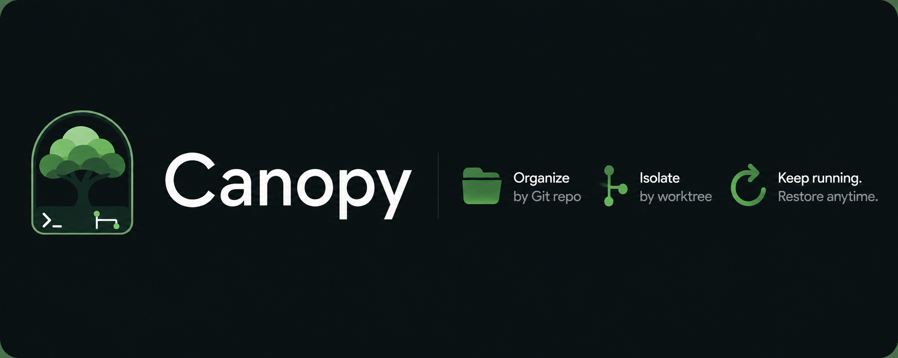
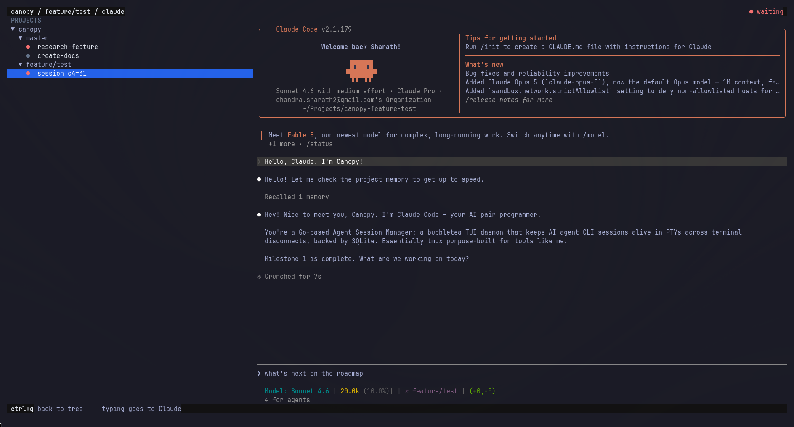

# Canopy



Canopy is a local session manager for AI coding agents. It organizes Claude sessions by Git repository and worktree, keeps them running in a background daemon, and restores them after a restart.



## Install

On macOS or Linux, for amd64 or arm64:

```bash
curl -fsSL https://raw.githubusercontent.com/sharathk-dev/canopy/master/install.sh | bash
```

The installer places `canopy` in `~/.local/bin`. Open a new terminal, or source the shell profile shown by the installer.

The installer uses published GitHub Release binaries. To install a specific version:

```bash
VERSION=v0.1.0 curl -fsSL https://raw.githubusercontent.com/sharathk-dev/canopy/master/install.sh | bash
```

## Quick start

Register a Git repository and open Canopy:

```bash
cd /path/to/project
canopy project add
canopy
```

Inside the TUI:

| Key | Action |
| --- | --- |
| `n` | Name and start a Claude session in the selected worktree; blank uses a random `session_` name |
| `Enter` | Expand a project/worktree or attach to a session |
| `Tab` | Switch between the project tree and output panel |
| `w` | Create a new branch and worktree |
| `x` | Remove the selected project/worktree or terminate a session |
| `Ctrl+Q` | Leave an attached session and return to the tree |
| `q` | Quit the TUI |

Quitting the TUI does not intentionally terminate sessions. Relaunching `canopy` restores non-archived sessions. Claude sessions are resumed with their native session ID when one has been captured.

## CLI commands

```bash
canopy project add [path]
canopy project list
canopy worktree list
canopy worktree add <branch> [--base branch] [--path path]
canopy worktree remove <path>
canopy session new [--tool claude] [--cwd path]
canopy session list
canopy session attach <session-id>
canopy session resume <session-id>
canopy session kill <session-id>
canopy daemon status
canopy daemon start
canopy daemon stop
canopy daemon install       # start at login (macOS/Linux)
canopy schedule add <name> --skill <skill> --cron "0 9 * * 1-5"
canopy schedule list
canopy schedule run <name>
canopy schedule runs <name>
```

`session kill` asks for confirmation before terminating a session.

## Build from source

Requires Go. The repository includes a conventional `Makefile`:

```bash
make fmt               # format Go files
make check             # verify formatting and run tests
make build             # create ./canopy
make install           # install to ~/.local/bin/canopy
make clean             # remove ./canopy
```

You can customize the install location:

```bash
make install PREFIX="$HOME/.local"
```

For implementation details, persistence, hooks, recovery behavior, and known limitations,
see the [technical design](docs/plan/spec.md).

## License

Canopy is licensed under the GNU General Public License v3.0 or later. See [LICENSE](LICENSE).
